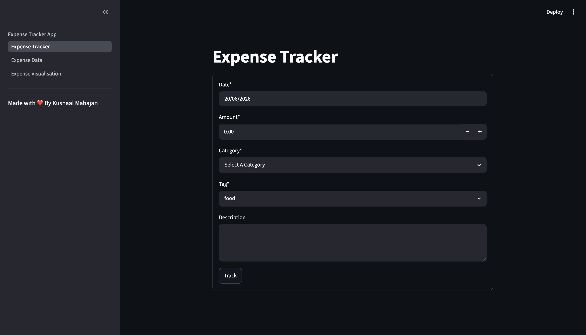
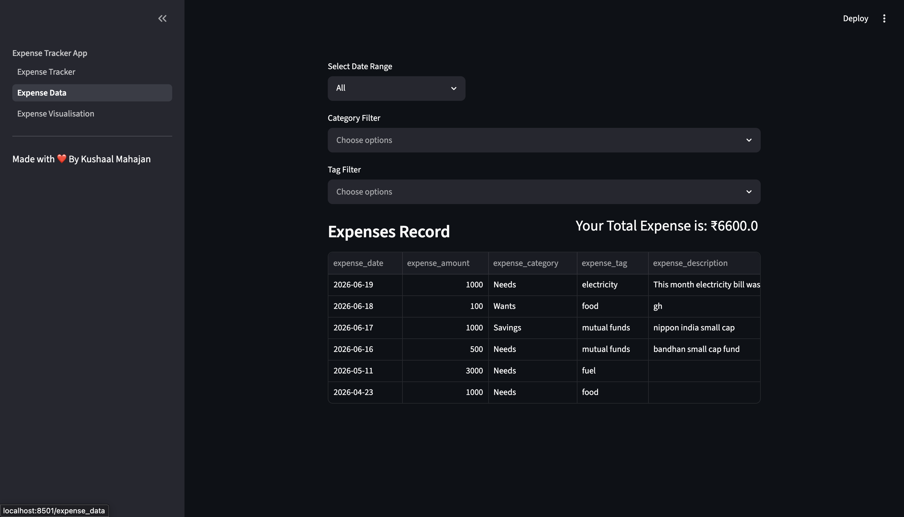
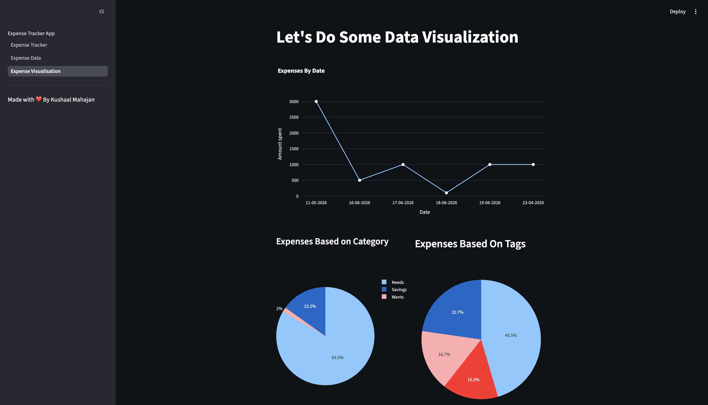

# Expense Tracker
A personal expense tracking web app, made using python, streamlit, SQLite3.
Track expeneses, Analyse expenses using desire filters, Visualise data using interactive graphs.

## Features
Add and store expenses in database
Categorize expense (Needs, Wants, Savings)
Custom Tagging system
Date range filtering
Filtering based on category and tag
Expense History Data
Interactive visualization
SQLite database integration

##Tech Stack
Python
Streamlit
SQLite
Pandas
Plotly

##Installation
1. Clone the repo
   '''git clone https://github.com/kushaalmahajan2008/Expense-Tracker'''
2. Install Requirements
   a. streamlit
   b. pandas
   c. plotly
3. Database Initalization
   run init_db.py
4. Run streamlit command in terminal
   '''streamlit run expenses.py'''

## Screenshots

### Expense Entry

### Expense Records

### Visualizations

